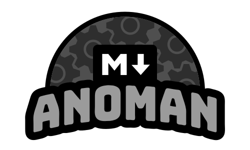

<div align="center">
[](https://github.com/golangid/anoman)
<br>
<br>
Very simple README generator for your repository
</div>

#

### Todo

- validation

### Installation
- <b>Build from source</b>
```shell
$ go get github.com/golangid/anoman

$ go build

$ ./anoman -v
```
- <b>Mac OS</b>
```shell
$ brew tap golangid/tool

$ brew install anoman
```

- <b>Get specific release (eg: for Linux)</b>
```shell
$ wget https://github.com/golangid/anoman/releases/download/v0.0.0/anoman-v0.0.0.linux-amd64.tar.gz

$ tar -zxvf anoman-v0.0.0.linux-amd64.tar.gz

$ anoman -v
```

### Usage
```shell
$ anoman -o README.md
$
$ echo just answer the given questions :)
$
$ project name ? : Anoman
$
$ website ? : www.anoman.com
$
$ project descriptions ? : README Generator for your project
$
$ notice ? : this project still in development, but ready to use
$
$ author name ? : golangid
$
$ year ? : 2019
```

#### Result
<div align="center">
<h1>ANOMAN</h1>
www.anoman.com
</div>

### What is Anoman?
README Generator for your project

> #### Important Notice
> this project still in development, but ready to use

### Usage:
- one
- two
- three

#
### Author
**golangid 2019**

#

### Golangid 2019